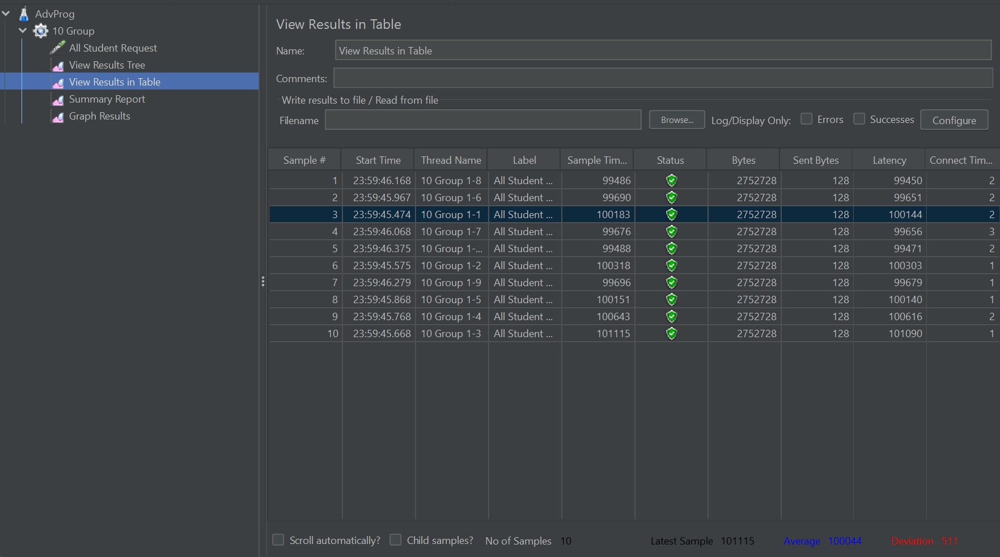
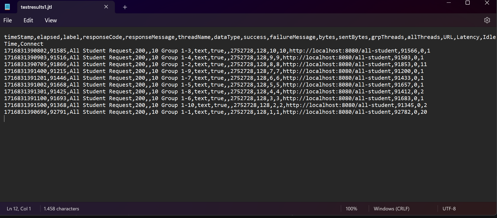
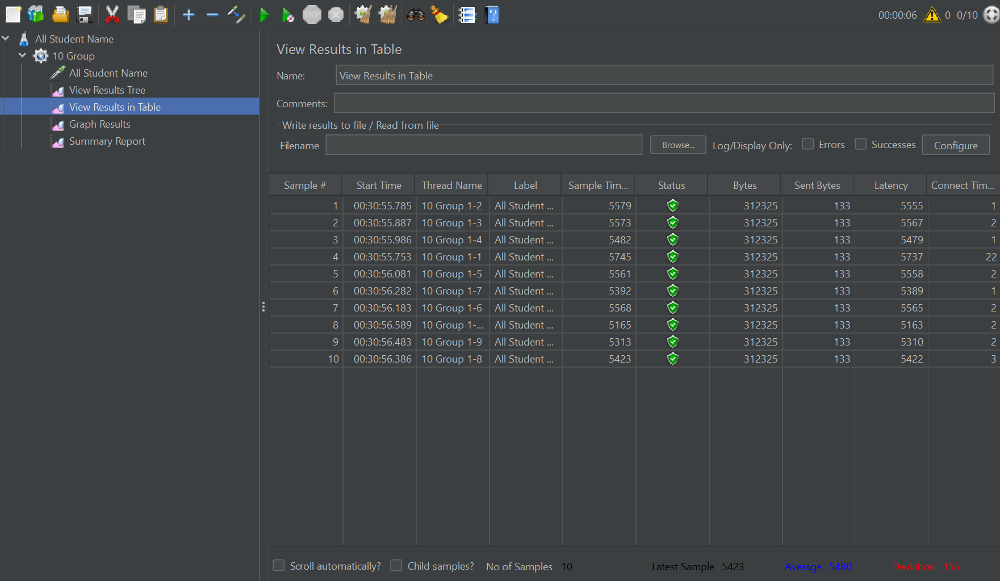
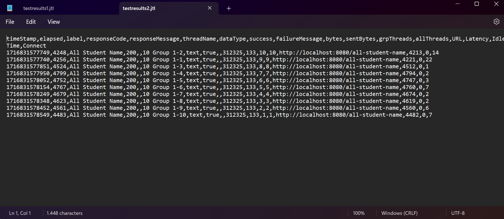
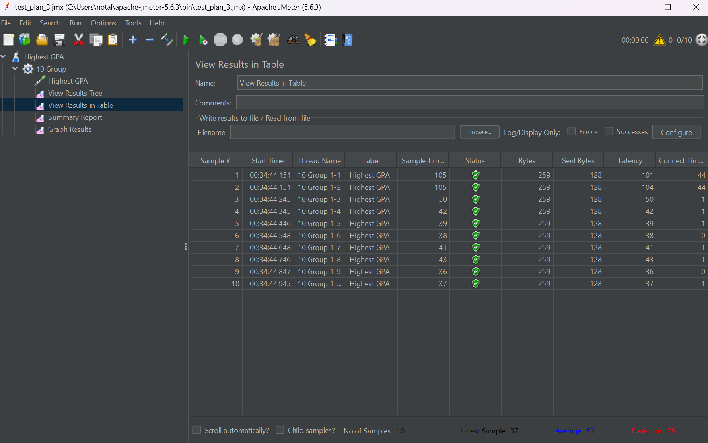
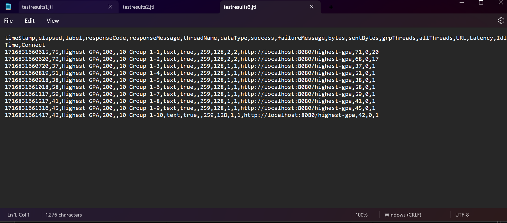

## Test plan 1 (All Student)

## Best Practice Test Plan 1 (All Student)

## Test plan 2 (All Student Name)

## Best Practice Test Plan 2 (All Student Name)

## Test plan 3 (Highest GPA)

## Best Practice Test Plan 3 (Highest GPA)

