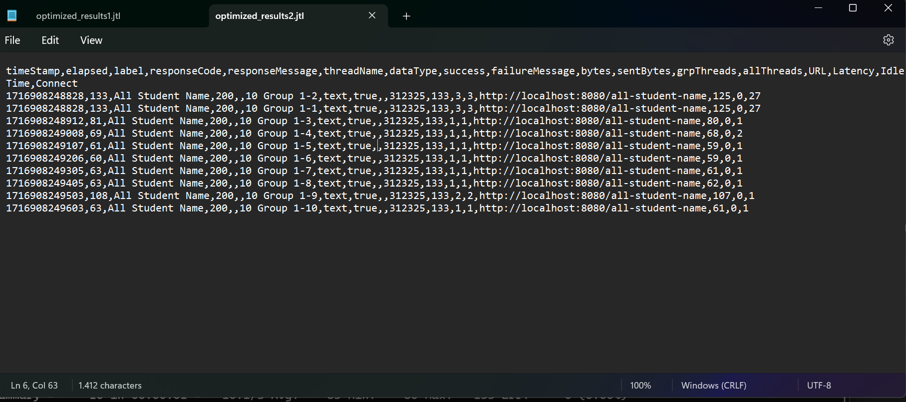

# Tutorial Profiling

## Command for JMeter CLI
```
jmeter -n -t [test_plan_file.jmx] -l [test_result_log.jtl] 
```

## Before Optimization

### Test plan 1 (All Student)


### Best Practice Test Plan 1 (All Student)


### Test plan 2 (All Student Name)


### Best Practice Test Plan 2 (All Student Name)


### Test plan 3 (Highest GPA)


### Best Practice Test Plan 3 (Highest GPA)


## After Optimization

### Test plan 1 (All Student)


### Best Practice Test Plan 1 (All Student)


### Test plan 2 (All Student Name)


### Best Practice Test Plan 2 (All Student Name)


### Test plan 3 (Highest GPA)


### Best Practice Test Plan 3 (Highest GPA)
